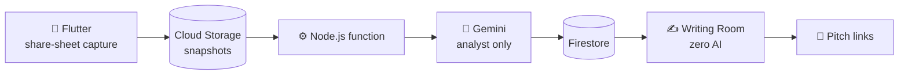

<div align="center">

<br/>

# 📜 F O O L S C A P

**Paper for people who write.**

*A scriptwriting hideout for people who make reels for a living,<br/>where the machine does the reading and you do all the writing.*

<br/>


</div>

<br/>

---

<br/>

It's 1:47 a.m.

You have a car brand's content due Monday, and you *know* you saved the perfect reel three weeks ago. The one where the guy just stares at the dashboard for a full second before saying anything. You scroll through Saved. Four hundred videos. No search bar. No folders you actually used. Half the thumbnails are grey now because the creators deleted them.

So you do what everyone does. You open a blank doc and write the same "Stop scrolling if you drive a…" hook you wrote last week.

**Foolscap exists so that never happens again.**

<br/>

## 🃏 Why Foolscap?

Foolscap is the old paper size writers used for centuries, long before screens. It's also said to be named after the jester's cap that once watermarked the sheets. A page for people who write, with a fool's cap in the corner as a reminder that the funniest, sharpest stuff always came from a person willing to look a bit ridiculous.

That's the whole app. Hoard references like a lunatic, then write your script with your own hands, on a clean sheet.

> **Scrape the world. Write it yourself.**

<br/>

## 🚫 The one rule

There is no AI in the writing. Not a toggle. Not a "just polish this". Not a sneaky autocomplete.

AI in Foolscap does the jobs nobody should be doing at 1:47 a.m.: saving, transcribing, measuring, remembering, noticing. It **reads**. The second a cursor blinks in the writing room, the machine is out of the building.

Why so strict? Because people are tired of slop. Gartner found half of US consumers say they'd rather buy from brands that keep generative AI out of customer-facing content. The scarce thing on the timeline now is a person who is visibly, stubbornly human. We're building for that person.

> **AI reads. Humans write.**

<br/>

## 📅 A Monday with Foolscap

Easiest way to explain it is to walk through a day.

**9:00.** New client: a car brand. You make a workspace, drop in their tone, the words they never say, the disclaimers legal makes you add, and the model specs. This is the **Brand Bible**, and it quietly checks every script you write against it. Plain rules, no AI judgment. *The client's lawyer reads your script before you do.*

**9:30.** You go hunting. Share a reel from Instagram, TikTok or YouTube straight into Foolscap from your phone. It keeps a snapshot, so when the creator deletes it, you still have it. It pulls the transcript, the on-screen text, the caption. It even copes with that Urdu / Roman Urdu / English mashup that real people actually speak. Everything is searchable by anything *said* or *shown*.
*If you saw it, you own the receipt.*

**10:15.** You open **X-Ray** on the reel you love. It breaks the video into beats: how long the hook lasts, how fast the cuts come, when the text appears, how many words a minute, where the pauses are. It tells you how far this video outran its own account's normal numbers. And there's one field it will never fill in: **"Why it worked."** That one is yours.
*Know exactly why it worked. Then do it differently.*

**11:00.** You find the moment. Three seconds where the creator does a slow, deadpan blink at the camera and the whole video turns. You clip it into the **Expression Vault**, tag it *deadpan*, and pin it to line 4 of your script. Now your script doesn't just say what to say. It shows the face.
*Don't tell them what it should feel like. Show them the face.*

**11:30.** The **Writing Room**. Left column is what we hear. Right column is what we see. Your reference sits pinned beside the draft like a friend at the next desk. A live timer reads your script at *your* speaking pace and tells you it's 34 seconds, and you wanted 30. You write ten hooks on the Hook Bench and keep the one that makes you grin. If your draft starts drifting too close to a saved reference, the **Overlap Alarm** taps your shoulder. You can steal a feeling. You can't steal the words.
*A blank page is scary. A blank page with autocomplete is worse.*

**14:00.** Send the pitch. One link: script, reference clips, shot list. The client comments at the exact second they have a problem, you see a revision counter instead of a vibe, and "approved" actually locks the version. Works great where approvals live on WhatsApp.
*Approve it before you film it.*

**Friday.** Shoot day. **Set Mode** is the script for the real world: huge type, works offline, mirrors for a teleprompter, scrolls as you speak. You mark good takes against the exact line they belong to.

**Next month.** The post goes live, and Foolscap ties it back to the script that made it. Day one, week one, month one. You write your own retro notes, and over time it shows you what actually wins for *this* client. Dead ideas go to the **Script Graveyard**, where they can be resurrected.
*Every script deserves an after-party.*

<br/>

## 🧭 The stuff on the horizon

Some things are further out but they're the ones I'm most excited about.

- **Research Radar.** Track competitors, dealers, creators, and neighbouring niches. Get pinged when something outperforms. Mine comment sections for the questions and objections customers keep repeating, then you pick which ones become angles. There's also a **Format Arbitrage Board** for formats crushing it in other niches that nobody in yours has touched yet.
*Let the machine do the scrolling. You do the thinking.*
- **Human Ink.** A timestamped authorship history you can export as a one-pager for brands that need proof a person wrote it.
*Proof of pulse.*

<br/>

## 🔧 Under the hood

Plain-English version. The Flutter app catches what you share and uploads it. A Node.js Cloud Function wakes up, hands the video to Gemini, and gets back a strictly shaped bundle of facts: timestamps, hook type, cut counts, labels. All of it lands in Firestore. The writing room reads from there.



**The AI firewall.** The no-AI promise isn't a setting, it's architecture:

1. Gemini only gets called from server-side functions. The key never ships in the app.
2. Every call uses a strict schema made of enums, numbers, timestamps and short labels. There is no field that *can* hold a generated script.
3. The writing room doesn't import an AI client at all. Not hidden. Not off. Absent.
4. Every edit is logged with its author, which is where Human Ink comes from.

**Rough data shape:**

```
workspaces/{wid}
 ├─ clients/{cid}      brand bible: tone, banned words, disclaimers
 ├─ references/{rid}   source, snapshot, transcript, beats, hook type,
 │                     outlier score, expression clips
 ├─ scripts/{sid}      title, format, status, linked references
 │   └─ versions/{vid} rows, author, timestamp
 └─ pitches/{pid}      script, references, comments, approval
```

<br/>

## 🧪 The honest bits

Because I'd rather you hear it from me:

- **Gemini can genuinely watch video.** Files up to 2 GB through its Files API, small clips inline, public YouTube links directly. A minute of reel costs roughly 100 to 300 tokens per second depending on resolution, which is pocket change.
- **But a TikTok or Instagram *link* isn't a video.** Gemini won't pull from arbitrary links, and Meta's embed API only returns embed code. So v1 is "bring the file": save the reel, share it into Foolscap. YouTube links work as-is.
- **Bulk scraping is a different beast.** Platforms ban automated access in their terms. The Radar should run on licensed data or official routes, not a scraper I duct-tape together. Get proper legal advice before you ship it.
- **Firebase needs the Blaze plan** for Functions and Storage. Set budget alerts on day one. Future you says thanks.
- **Roman Urdu + English is the real exam.** There's no standard spelling and everyone mixes languages mid-sentence. Test it on your own clips before trusting it.

<br/>

## 🛤 The plan, loosely

1. **The Library.** Capture, snapshots, transcripts, X-Ray, folders, search.
2. **The Room.** Writing room, timers, direction tags, pinned references, Expression Vault.
3. **The Pitch.** Shareable links, comments, approvals.
4. **The Guardrails.** Brand Bible, linter, pillar heatmap.
5. **The Radar.** Licensed data, outlier alerts, comment mining.
6. **The Set.** Teleprompter, take log, results loop, Human Ink.

<br/>

## 🚀 Run it

```bash
git clone https://github.com/kaifrizwan12/foolscap.git
cd foolscap

# the brain (server-side only)
cd functions && npm install
firebase functions:secrets:set GEMINI_API_KEY

# the pocket
cd ../app && flutter pub get
flutterfire configure
flutter run
```

You'll need a Firebase project on Blaze and a Gemini API key.

<br/>

---

<div align="center">

<br/>

*The machine reads. You write. The audience can tell.*

**Built by [Muhammad Kaif Nathani](https://github.com/kaifrizwan12)** · MIT

📜

</div>
